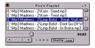



## Piro's Playlist v2\.0

### Description

This is an example of a very advanced Mp3 player very similar to WinAMP, though WinAMP has a lot of lag Piro's Playlist doesn't allowing users to browse the net and listen to music without getting kicked offline.
 
### More Info
 
Upon first use the program must build a settings.ini file for it to do some basic things like set the default skin, after your first time it should work just fine with only some minor bugs that wont harm anything.

             |
---                |---
**Submitted On**   |2000-11-25 17:30:36
**By**             |[Ian Whitcomb](https://github.com/Planet-Source-Code/PSCIndex/blob/master/ByAuthor/ian-whitcomb.md)
**Level**          |Advanced
**User Rating**    |4.3 (17 globes from 4 users)
**Compatibility**  |VB 5\.0, VB 6\.0
**Category**       |[Sound/MP3](https://github.com/Planet-Source-Code/PSCIndex/blob/master/ByCategory/sound-mp3__1-45.md)
**World**          |[Visual Basic](https://github.com/Planet-Source-Code/PSCIndex/blob/master/ByWorld/visual-basic.md)
**Archive File**   |[CODE\_UPLOAD13447162001\.zip](https://github.com/Planet-Source-Code/ian-whitcomb-piro-s-playlist-v2-0__1-14184/archive/master.zip)

